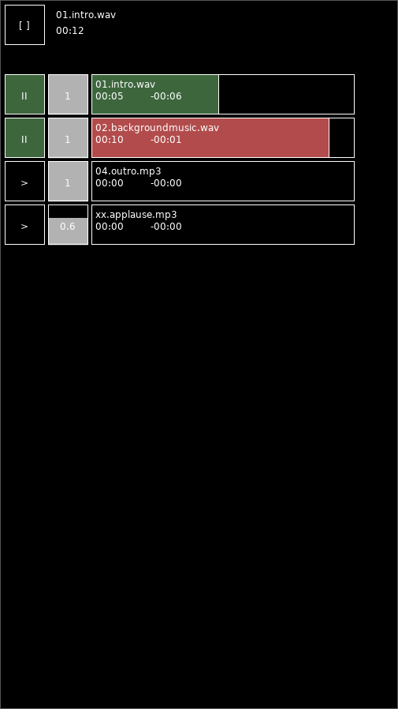
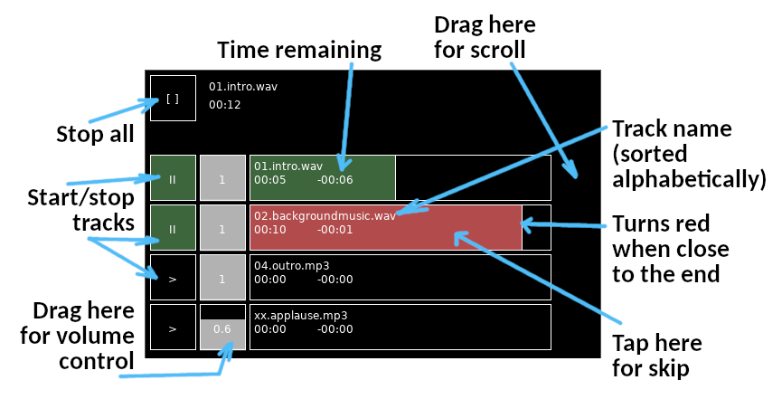

# Cuet
Minimalistic cue / background music player for theatre and live productions for Android.

Free & ad free.

Allows you to play mutliple track at once live. There is **no configuration** in the app. You have to put the files in the correct folder on the phone (the path is displayed when you start the app).
The tracks doesn't loop and the next track does not start automatically.

The screen never turns off while the app is on, but it stops playing when you switch to other app.

